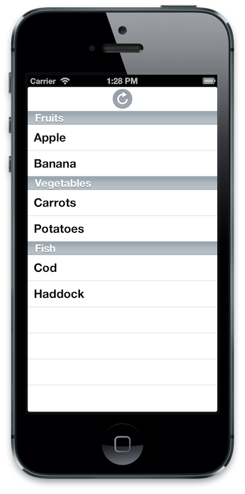

## TiISRefreshControl

Wrapping [ISRefreshControl](https://github.com/ishkawa/ISRefreshControl) for Ti.UI.TableView and Ti.UI.ListView on Titanium Mobile.

ISRefreshControl is iOS4-compatible UIRefreshControl.



## Feature
* Support the UIRefreshControl for Ti.UI.TableView and Ti.UI.ListView on iOS6
* Compatible UIRefreshControl on iOS4 and iOS5

## Install
```
$ git clone git@github.com:k0sukey/TiISRefreshControl.git
$ cd TiISRefreshControl
$ git submodule init
$ git submodule update
```

Open TiISRefreshControl.xcodeproj and edit the ISRefreshControl/ISGumView.m at line:46

```
// self.imageView.image = [UIImage imageNamed:@"ISRefresgControlIcon"];
self.imageView.image = [UIImage imageNamed:@"modules/be.k0suke.tiisrefreshcontrol/ISRefresgControlIcon.png"];
```

Execute build.py

```
$ ./build.py
```

## Usage
There is no need a lot of event handling for pull-to-refresh.
This is a very simply :D

### Classic style(for Ti.UI.TableView)
```
var tableView = Ti.UI.createTableView({
	refreshControlTintColor: '#f00', // optional
	data: [
		{ title: 'row0' },
		{ title: 'row1' },
		{ title: 'row2' },
		{ title: 'row3' },
		{ title: 'row4' },
		{ title: 'row5' },
		{ title: 'row6' },
		{ title: 'row7' },
		{ title: 'row8' },
		{ title: 'row9' }
	]
});

tableView.addEventListener('refreshstart', function(){
	setTimeout(function(){
		tableView.refreshFinish();
	}, 5000);
});
```

### Alloy(for Ti.UI.ListView and data binding)
#### View
```
<Window>
	<ListView id="lists" defaultItemTemplate="list">
		<Templates>
			<ItemTemplate name="list">
				<Label bindId="name" class="name"/>
			</ItemTemplate>
		</Templates>

		<ListSection id="section" dataCollection="lists" dataTransform="doTransform">
			<ListItem template="list" name:text="{name}"/>
		</ListSection>
	</ListView>
</Window>
```

#### Controller
```
var lists = Alloy.Collections.lists;

function doTransform(model) {
	return model.toJSON();
}

$.lists.addEventListener('refreshstart', function(){
	lists.fetch({
		success: function(){
			$.lists.refreshFinish();
		},
		error: function(){
			$.lists.refreshFinish();
		}
	});
});

$.index.addEventListener('open', function(){
	$.lists.refreshBegin();
});

$.index.open();
```

#### alloy.js
```
var lists = Alloy.Collections.lists = Alloy.createCollection('lists');
```

### Properties
#### refreshControlTintColor
The tint color for the refresh control.

### Methods
#### getRefreshControlTintColor / setRefreshControlTintColor
getter / setter for refreshControlTintColor.

#### isRefreshing
A Boolean value indicating whether a refresh operation has been triggered and is in progress.

#### refreshBegin
Tells the control that a refresh operation was started programmatically.

#### refreshFinish
Tells the control that a refresh operation has ended.

### Events
#### refreshstart
Refresh starting event.

#### refreshend
Refresh ending event.

## License

The MIT License (MIT) Copyright (c) 2013 Kosuke Isobe, Socketbase Inc.

Permission is hereby granted, free of charge, to any person obtaining a copy of this software and associated documentation files (the "Software"), to deal in the Software without restriction, including without limitation the rights to use, copy, modify, merge, publish, distribute, sublicense, and/or sell copies of the Software, and to permit persons to whom the Software is furnished to do so, subject to the following conditions:

The above copyright notice and this permission notice shall be included in all copies or substantial portions of the Software.

THE SOFTWARE IS PROVIDED "AS IS", WITHOUT WARRANTY OF ANY KIND, EXPRESS OR IMPLIED, INCLUDING BUT NOT LIMITED TO THE WARRANTIES OF MERCHANTABILITY, FITNESS FOR A PARTICULAR PURPOSE AND NONINFRINGEMENT. IN NO EVENT SHALL THE AUTHORS OR COPYRIGHT HOLDERS BE LIABLE FOR ANY CLAIM, DAMAGES OR OTHER LIABILITY, WHETHER IN AN ACTION OF CONTRACT, TORT OR OTHERWISE, ARISING FROM, OUT OF OR IN CONNECTION WITH THE SOFTWARE OR THE USE OR OTHER DEALINGS IN THE SOFTWARE.